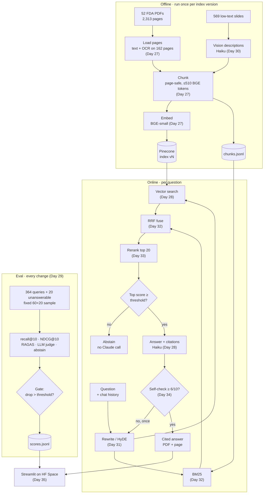

# Multimodal RAG Engine

Ask questions over 52 FDA PDFs (slide decks + 2 books). The system retrieves pages, answers with verified citations, abstains when the answer is not in the documents, and is scored by an eval pipeline that gates every change.

Dataset: ViDoRe V3 Pharmaceuticals (`vidore/vidore_v3_pharmaceuticals`, CC BY 4.0), 2,313 pages, 364 English queries with graded page labels, plus 20 hand-written unanswerable queries.

## Architecture



### Modules

Package `multimodal_rag/`.

| File | Does | Day |
|---|---|---|
| `config.py` | Constants: paths, model IDs, index name, thresholds, prices, flags | 27 (grows) |
| `ingest.py` | PDFs → `Page` → `Chunk`; writes `chunks.jsonl`; embeds and upserts | 27, 30 |
| `retrieve.py` | Vector search, BM25, RRF, rerank, rewrite/HyDE | 28, 31–33 |
| `answer.py` | Haiku call with citations, citation verification, abstain, cost, self-check | 28, 34 |
| `vision.py` | Slide image → Haiku description | 30 |
| `evaluate.py` | Retrieval metrics, RAGAS, LLM judge, abstain score, gate, score log | 28–29 |
| `streamlit_app.py` (repo root) | One-page UI | 35 |

### Data files

| File | Contents | Day |
|---|---|---|
| `data/chunks.jsonl` | All chunks (BM25 + UI display), ~3 MB | 27 |
| `data/eval/unanswerable_en.jsonl` | 20 unanswerable queries | 27 |
| `data/eval/sample.json` | IDs of the fixed 60 + 20 eval sample | 28 |
| `data/eval/followups.jsonl` | 10 two-turn conversations | 31 |
| `data/vision.jsonl` | 569 slide descriptions | 30 |
| `data/scores.jsonl` | Timestamped eval log | 29 |

### Stage contracts

Frozen dataclasses passed between stages:

| Type | Fields | Made by → used by |
|---|---|---|
| `Page` | `doc_id`, `page` (0-indexed), `text`, `ocr: bool` | ingest → chunking |
| `Chunk` | `chunk_id` (`doc_id-page-n`), `doc_id`, `page`, `text`, `n_tokens`, `kind` (`text` or `vision`) | chunking → index, BM25, answer |
| `Hit` | `chunk: Chunk`, `score` | retrieve → answer, eval |
| `Citation` | `chunk_id`, `doc_id`, `page`, `cited_text`, `generated: bool` | answer → UI, eval |
| `Answer` | `text`, `citations`, `abstained`, `cost_usd`, `latency_s`, `confidence` | answer → UI, eval |

**Pinecone record:** id = `chunk_id`, 384-d vector, metadata = `doc_id`, `page`, `text`, `kind`, `embedding_model`. Index `fda-bge-small-en-v1-5-v1` (the version suffix goes up on re-index), namespace `fda`. Embedding model: `BAAI/bge-small-en-v1.5`.

**Flags** (environment variables, only the measured ablations): `VISION`, `REWRITE`, `HYDE`, `RETRIEVAL=vector|hybrid`, `RERANK`, `SELF_CHECK`.

### Chunking rule

```
page text → slide page: 1 candidate
          → book page:  chunk_by_title(max_characters=1500) → 1–3 candidates
candidate → count BGE tokens
          → ≤ 510: keep
          → > 510: split at sentence boundaries, packing sentences up to 510
                   (a single sentence over 510 is split by words)
every final chunk ≤ 510 BGE tokens and never crosses a page
```

510 = BGE's 512-token limit minus `[CLS]` and `[SEP]`.

### Fixed facts the code relies on

- Dataset pages are 0-indexed; `unstructured` pages are 1-indexed, so subtract 1.
- OCR runs per page, only on the 162 low-text pages (~3 s/page).
- Haiku 5.5: never pass `temperature`. RAGAS uses `bypass_temperature=True` with `langchain-community<0.4`.
- Rerank at most the top 20 (~1.6 s on 2 CPUs).
- Docker uses CPU-only torch.
- The eval sample is never used for tuning.
