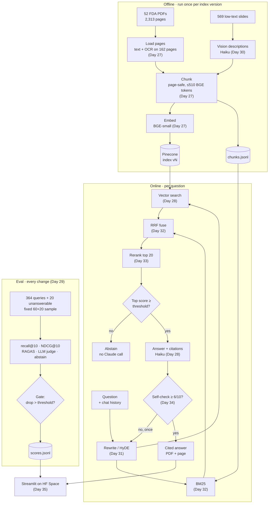

# Multimodal RAG Engine

Ask questions over 52 FDA PDFs (slide decks + 2 books). The system retrieves pages, answers with verified citations, abstains when the answer is not in the documents, and is scored by an eval pipeline that gates every change.

Dataset: ViDoRe V3 Pharmaceuticals (`vidore/vidore_v3_pharmaceuticals`, CC BY 4.0), 2,313 pages, 364 English queries with graded page labels, plus 20 hand-written unanswerable queries.

## Architecture



### Modules

Package `multimodal_rag/`.

| File | Does | Day |
|---|---|---|
| `config.py` | Constants: paths, model IDs, index name, thresholds, prices, flags | 27 (grows) |
| `contracts.py` | The stage-contract dataclasses below (kept out of `ingest.py` so the query path never imports `unstructured`) | 28 |
| `ingest.py` | PDFs → `Page` → `Chunk`; writes `chunks.jsonl`; embeds and upserts | 27, 30 |
| `retrieve.py` | Vector search, BM25, RRF, rerank, rewrite/HyDE | 28, 31–33 |
| `answer.py` | Haiku call with citations, citation verification, abstain, cost, self-check | 28, 34 |
| `vision.py` | Slide image → Haiku description | 30 |
| `evaluate.py` | Retrieval metrics, RAGAS, LLM judge, abstain score, gate, score log | 28–29 |
| `streamlit_app.py` (repo root) | One-page UI | 35 |

### Data files

| File | Contents | Day |
|---|---|---|
| `data/chunks.jsonl` | All chunks (BM25 + UI display), ~4 MB | 27 |
| `data/eval/unanswerable_en.jsonl` | 20 unanswerable queries | 27 |
| `data/eval/sample.json` | IDs of the fixed 60 + 20 eval sample | 28 |
| `data/eval/followups.jsonl` | 10 two-turn conversations | 31 |
| `data/vision.jsonl` | 569 slide descriptions | 30 |
| `data/scores.jsonl` | Timestamped eval log | 29 |

### Stage contracts

Frozen dataclasses passed between stages:

| Type | Fields | Made by → used by |
|---|---|---|
| `Page` | `doc_id`, `page` (0-indexed), `text`, `ocr: bool` | ingest → chunking |
| `Chunk` | `chunk_id` (`doc_id-page-n`), `doc_id`, `page`, `text`, `n_tokens`, `kind` (`text` or `vision`) | chunking → index, BM25, answer |
| `Hit` | `chunk: Chunk`, `score` | retrieve → answer, eval |
| `Citation` | `chunk_id`, `doc_id`, `page`, `cited_text`, `score`, `generated: bool` | answer → UI, eval |
| `Answer` | `text`, `citations`, `abstained`, `cost_usd`, `latency_s`, `confidence` (added Day 34) | answer → UI, eval |

**Pinecone record:** id = `chunk_id`, 384-d vector, metadata = `doc_id`, `page`, `text`, `kind`, `embedding_model`. Index `fda-bge-small-en-v1-5-v1` (the version suffix goes up on re-index), namespace `fda`. Embedding model: `BAAI/bge-small-en-v1.5`.

**Flags** (environment variables, only the measured ablations): `VISION`, `REWRITE`, `HYDE`, `RETRIEVAL=vector|hybrid`, `RERANK`, `SELF_CHECK`.

### Chunking rule

```
page text → slide page: 1 candidate
          → book page:  chunk_by_title(max_characters=1500) → 1–3 candidates
candidate → count BGE tokens
          → ≤ 510: keep
          → > 510: split at sentence boundaries, packing sentences up to 510
                   (a single sentence over 510 is split by words)
every final chunk ≤ 510 BGE tokens and never crosses a page
```

510 = BGE's 512-token limit minus `[CLS]` and `[SEP]`.

### Fixed facts the code relies on

- Dataset pages are 0-indexed. The loader takes the page number from its pypdf loop index (0-indexed), never from `unstructured` (1-indexed). `pdftoppm` is 1-indexed, so OCR passes `page + 1`.
- `partition_pdf(strategy="fast")` drops a whole PDF to `hi_res` with no text if any one page has heavy vector graphics (2 of 52 files, incl. the 373-page book). So each page is partitioned as its own 1-page PDF; only the heavy page falls back and gets OCR.
- OCR runs per page, only on the 162 low-text pages (~3 s/page).
- Haiku 5.5: never pass `temperature`. RAGAS uses `bypass_temperature=True` with `langchain-community<0.4`.
- Rerank at most the top 20 (~1.6 s on 2 CPUs).
- Docker uses CPU-only torch.
- The eval sample is never used for tuning.

## Retrieval and answering (Day 28)

Try one question: `python -m multimodal_rag.answer "your question"`. Retrieval baseline and threshold: `python -m multimodal_rag.evaluate` (free, ~40 s, no Claude calls).

Query → BGE vector (with the BGE query instruction) → Pinecone top 20 → chunk text from `data/chunks.jsonl` → if the top score is below `ABSTAIN_SCORE`, abstain with no Claude call → otherwise the top 10 chunks go to Haiku as one plain-text document each, with citations on. A citation is kept only if its `cited_text` equals `chunk.text[start:end]` of the chunk it points to. Timeouts: Pinecone 10 s, Claude 30 s per attempt (the SDKs retry on their own). Pinecone timeouts, connection errors and 5xx, Claude API errors, and any `stop_reason` other than `end_turn` raise `QueryError`.

### Day 28 results (index `fda-bge-small-en-v1-5-v1`)

| Measure | Value |
|---|---|
| recall@10 (page-level, 364 queries) | **0.5575** |
| NDCG@10 (gain = qrel grade 1/2) | **0.5037** |
| Queries with > 10 gold pages (recall can't reach 1.0) | 43 |
| Eval sample (`data/eval/sample.json`, seed 28, never changed) | 60 answerable (stratified by query type × visual content; 36 visual) + 20 unanswerable |
| `ABSTAIN_SCORE` = 5th percentile of top-1 score on the 304 non-sample queries | 0.6837 |
| Sample answerable below it (false abstains) | 4/60 |
| Unanswerable below it (correct abstains with no Claude call) | 1/20 |
| Top-1 score range | answerable 0.618–0.883, unanswerable 0.671–0.816 |
| Cost per answered question (10 chunks, about 4.5k tokens in) | $0.0005–0.0013 |

The score threshold does little: unanswerable top-1 scores sit inside the answerable range, so it catches 1 of 20. In practice Claude does the abstaining: it returned `ABSTAIN_TEXT` on both unanswerable questions in the spot-check. Abstain accuracy both ways is measured on Day 29.

Hits are chunks and gold labels are pages, so the eval dedupes the 20 chunks to pages and scores the first 10 distinct pages. Measured effect: small. The top 10 chunks already cover 9.76 distinct pages on average, and scoring them directly gives recall@10 0.5540 instead of 0.5575.

### Three deliberate breaks, diagnosed with the 4-step loop

The loop: (1) is the answer in the corpus (gold pages)? (2) were those pages retrieved, and at what rank and score? (3) what actually went into the prompt? (4) given known-good chunks, does Claude answer correctly?

| Break | Symptom | Step that found it | Evidence |
|---|---|---|---|
| Queries embedded with `all-MiniLM-L6-v2` (also 384-d, a different vector space) against the BGE index | Wrong pages, no error raised | 2 | recall@10 0.5575 → 0.2312, NDCG@10 0.5037 → 0.1829; mean top-1 score 0.776 → 0.263, so every query would fall below `ABSTAIN_SCORE`. Random query vectors give recall 0.0053, so MiniLM is far above chance. My unverified guess is that the two small BERT models' spaces partly line up. |
| Each chunk cut to its first 300 characters before it goes to Claude (query 47) | "The documents do not contain the answer." | 3 | The gold page is still retrieved at rank 1, but the fact ("18 months … 10,000 individuals") sits at character 621. With full chunks (step 4), Claude answers and cites it. |
| `max_tokens=40` | `QueryError: Claude stopped with max_tokens` | 4 (`stop_reason` check) | Without the check, a cut-off sentence with partial citations would have been returned as an answer. |

### Spot-check of 10 outputs (8 non-sample answerable + 2 unanswerable, $0.0066 for the final outputs)

| Query | Result |
|---|---|
| 243 naloxone OTC consumer research | Correct, cited the gold pages |
| 327 CGMP and drug quality | Correct |
| 43 EU small-molecule data exclusivity | Answers with the current 8+2+1 rule. The reference says 6 years (Directive 87/21/EEC), which the answer mentions as the earlier rule. Defensible. |
| 228 unit-of-use packaging (yes/no) | Hedges ("documents don't confirm") where the reference says yes. The cited page isn't the gold page but carries the same slide text. |
| 28 biosimilar vs interchangeable | Correct, 2,962 characters (reference is about 300) |
| 57 decentralized trials and digital health | Correct and partial; says it's partial |
| 197 refuse-to-receive % FY15 vs FY16 | **False abstain, step 3.** Gold page retrieved at rank 3, but the bar chart extracts as loose numbers ("19 25 13 FY 15 FY 16 FY 17 8.3"), so the year-to-value pairing is lost. Claude declined to guess. Day 30 vision descriptions target this. |
| 95 injectables vs solid oral first-cycle approvals (keyword query) | **False abstain, step 2.** The gold page holds the exact phrase "Injectables > solid oral > others" but isn't in the top 10. A keyword match should find it (BM25, Day 32). |
| ua03 GDUFA III CMO fee (trap) | Claude abstained |
| ua01 Spravato REMS monitoring | Abstained by threshold, no Claude call |

Fixed during the spot-check: with `ANSWER_MAX_TOKENS = 1024`, queries 28 and 57 stopped at `max_tokens` (the `stop_reason` check raised `QueryError`). One needed 1,598 output tokens, since citations add output tokens. Raised to 2048; both then ended with `end_turn`.

Observed and not changed today (prompt changes wait for the Day 29 gate): Haiku often opens with a hedge about what the documents do or don't say, and open-ended answers run about 10× the reference length. This may lower answer relevancy on Day 29.

## Indexing

Run: `python -m multimodal_rag.ingest` (about 6.5 min on an M3, about 19 min on 2 CPUs; $0). It writes `data/chunks.jsonl`, embeds, upserts to the index named in `config.py` and prints the vector count.

### Day 27 results (index `fda-bge-small-en-v1-5-v1`, built 2026-10-09 on an M3 MacBook Air)

| Measure | Value |
|---|---|
| Pages loaded | 2,313 of 2,313 |
| Pages OCR'd (< 50 chars of text) | 165, none empty or timed out |
| Chunks = Pinecone vectors | 4,183 (books 2,672 = 3.2 per page; slides 1,511) |
| Max chunk size | 510 BGE tokens |
| Page alignment vs dataset (sandbox run) | 2,129 / 2,148 text pages match their own page best; the rest tie with near-identical neighbouring slides |
| Time | load + chunk 223 s, embed 92 s (CPU), total 6 min 24 s |
| Claude cost | $0 |

Known: 131 book chunks are under 20 tokens (`chunk_by_title` tails, page numbers); OCR of one scanned newsletter page (DDI deck page 80) is unreadable. Any chunking change waits for the Day 28 baseline.

### Re-index procedure

1. Bump the version suffix of `INDEX_NAME` in `config.py` (`…-v1` → `…-v2`). Never re-ingest into the live index: chunk IDs are deterministic, so changed pages overwrite, but IDs that no longer exist (a page that now yields fewer chunks) would stay behind as stale vectors.
2. Run ingest. It creates the new index and checks that the vector count equals the number of chunks.
3. Run the eval against the new index. Accept it only if the gate passes (from Day 29).
4. Commit `config.py` and `data/chunks.jsonl` together. BM25 and Pinecone must come from the same chunk file.
5. Delete the old index only after the new one is accepted (Pinecone free tier holds 5 indexes).

### Blast radius

A bad ingest affects only the index named in `config.py` and `data/chunks.jsonl`, plus anything that reads them: answers, citations, eval scores and the UI. It does not touch the dataset (read-only), the Day 25 index or other projects. Queries must use the same embedding model as the index; the model id is in the index name and in every record's metadata.

### Rollback

- Code and config: `git revert` the commit. `INDEX_NAME` and `chunks.jsonl` go back together, and the previous index still exists because it is deleted only after the new one is accepted.
- Data: if the live index itself is damaged (e.g. a bad upsert into v1), delete namespace `fda` and re-run ingest at the last good commit. Chunk IDs and the chunk count are deterministic, so this rebuilds the same records. Chunk text is not byte-identical: two runs on the same machine differed in 1 of 4,183 chunks (overlapping glyphs that pdfminer orders differently from call to call); the sandbox vs the Mac differed in 105 (101 on OCR pages, from a different tesseract build). Always commit the `chunks.jsonl` written by the run that built the live index.
